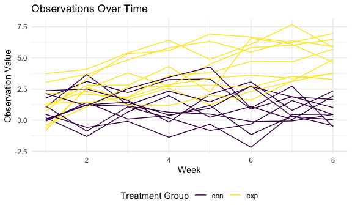
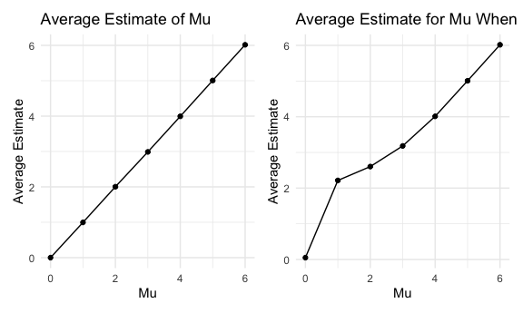

p8105\_hw5\_km3529
================
Karina Myers
11/10/2020

``` r
library(tidyverse)
```

    ## ── Attaching packages ────────────────────────────────────────────── tidyverse 1.3.0 ──

    ## ✓ ggplot2 3.3.2     ✓ purrr   0.3.4
    ## ✓ tibble  3.0.3     ✓ dplyr   1.0.2
    ## ✓ tidyr   1.1.2     ✓ stringr 1.4.0
    ## ✓ readr   1.3.1     ✓ forcats 0.5.0

    ## ── Conflicts ───────────────────────────────────────────────── tidyverse_conflicts() ──
    ## x dplyr::filter() masks stats::filter()
    ## x dplyr::lag()    masks stats::lag()

``` r
library(patchwork)

knitr::opts_chunk$set(
  fig.width = 6,
  fig.asp = .6,
  out.width = "90%"
)

theme_set(theme_minimal() + theme(legend.position = "bottom"))

options(
  ggplot2.continuous.colour = "viridis",
  ggplot2.continuous.fill = "viridis"
)

scale_colour_discrete = scale_colour_viridis_d
scale_fill_discrete = scale_fill_viridis_d

set.seed(1)
```

## Problem 1

DESCRIBE THE RAW DATA\!\!\!\!\!\!\!\!

Import and create a city\_state variable (e.g. “Baltimore, MD”)

``` r
homicide_df = 
  read_csv("data/homicide/homicide.csv") %>% 
  mutate(
    city_state = str_c(city, state, sep = "_"), 
    resolved = case_when(
      disposition == "Closed without arrest" ~ "unsolved", 
      disposition == "Open/No arrest" ~ "unsolved", 
      disposition == "Closed by arrest" ~ "solved"
    ) ) %>% 
  select(city_state, resolved) %>% 
  filter(city_state != "Tulsa_AL")
```

    ## Parsed with column specification:
    ## cols(
    ##   uid = col_character(),
    ##   reported_date = col_double(),
    ##   victim_last = col_character(),
    ##   victim_first = col_character(),
    ##   victim_race = col_character(),
    ##   victim_age = col_character(),
    ##   victim_sex = col_character(),
    ##   city = col_character(),
    ##   state = col_character(),
    ##   lat = col_double(),
    ##   lon = col_double(),
    ##   disposition = col_character()
    ## )

Summarize within cities to obtain the total number of homicides and the
number of unsolved homicides (those for which the disposition is “Closed
without arrest” or “Open/No arrest”).

``` r
aggregate_df = 
  homicide_df %>% 
  group_by(city_state) %>% 
  summarize(
    hom_total = n(), 
    hom_unsolved = sum(resolved == "unsolved")
  )
```

    ## `summarise()` ungrouping output (override with `.groups` argument)

For the city of Baltimore, MD, use the prop.test function to estimate
the proportion of homicides that are unsolved; save the output of
prop.test as an R object, apply the broom::tidy to this object and pull
the estimated proportion and confidence intervals from the resulting
tidy dataframe.

``` r
prop.test(
  aggregate_df %>% filter(city_state ==  "Baltimore_MD") %>% pull(hom_unsolved), 
  aggregate_df %>% filter(city_state ==  "Baltimore_MD") %>% pull(hom_total)) %>%
  broom::tidy()
```

    ## # A tibble: 1 x 8
    ##   estimate statistic  p.value parameter conf.low conf.high method    alternative
    ##      <dbl>     <dbl>    <dbl>     <int>    <dbl>     <dbl> <chr>     <chr>      
    ## 1    0.646      239. 6.46e-54         1    0.628     0.663 1-sample… two.sided

Now run prop.test for each of the cities in your dataset, and extract
both the proportion of unsolved homicides and the confidence interval
for each. Do this within a “tidy” pipeline, making use of purrr::map,
purrr::map2, list columns and unnest as necessary to create a tidy
dataframe with estimated proportions and CIs for each city.

``` r
results_df = 
  aggregate_df %>% 
  mutate(
    prop_tests = map2(.x = hom_unsolved, .y = hom_total, ~prop.test(x = .x, n = .y)), 
    tidy_tests = map(.x = prop_tests, ~broom::tidy(.x))) %>% 
  select(-prop_tests) %>% 
  unnest(tidy_tests) %>%
  select(city_state, estimate, conf.low, conf.high)
```

Create a plot that shows the estimates and CIs for each city – check out
geom\_errorbar for a way to add error bars based on the upper and lower
limits. Organize cities according to the proportion of unsolved
homicides.

``` r
results_df %>% 
  mutate(city_state = fct_reorder(city_state, estimate)) %>% 
  ggplot(aes(x = city_state,  y = estimate)) + 
  geom_point() + 
  geom_errorbar(aes(ymin = conf.low, ymax = conf.high)) +
  theme(axis.text.x = element_text(angle = 90, vjust = 0.5, hjust = 1))
```


## Problem 2

This zip file contains data from a longitudinal study that included a
control arm and an experimental arm. Data for each participant is
included in a separate file, and file names include the subject ID and
arm.

Create a tidy dataframe containing data from all participants, including
the subject ID, arm, and observations over time:

Start with a dataframe containing all file names; the list.files
function will help Iterate over file names and read in data for each
subject using purrr::map and saving the result as a new variable in the
dataframe

``` r
path_df = 
  tibble(
    path = list.files("data/lda")
  ) %>% 
  mutate(
      path = str_c("data/lda/", path), 
      data = map(path, read_csv )) 
```

    ## Parsed with column specification:
    ## cols(
    ##   week_1 = col_double(),
    ##   week_2 = col_double(),
    ##   week_3 = col_double(),
    ##   week_4 = col_double(),
    ##   week_5 = col_double(),
    ##   week_6 = col_double(),
    ##   week_7 = col_double(),
    ##   week_8 = col_double()
    ## )
    ## Parsed with column specification:
    ## cols(
    ##   week_1 = col_double(),
    ##   week_2 = col_double(),
    ##   week_3 = col_double(),
    ##   week_4 = col_double(),
    ##   week_5 = col_double(),
    ##   week_6 = col_double(),
    ##   week_7 = col_double(),
    ##   week_8 = col_double()
    ## )
    ## Parsed with column specification:
    ## cols(
    ##   week_1 = col_double(),
    ##   week_2 = col_double(),
    ##   week_3 = col_double(),
    ##   week_4 = col_double(),
    ##   week_5 = col_double(),
    ##   week_6 = col_double(),
    ##   week_7 = col_double(),
    ##   week_8 = col_double()
    ## )
    ## Parsed with column specification:
    ## cols(
    ##   week_1 = col_double(),
    ##   week_2 = col_double(),
    ##   week_3 = col_double(),
    ##   week_4 = col_double(),
    ##   week_5 = col_double(),
    ##   week_6 = col_double(),
    ##   week_7 = col_double(),
    ##   week_8 = col_double()
    ## )
    ## Parsed with column specification:
    ## cols(
    ##   week_1 = col_double(),
    ##   week_2 = col_double(),
    ##   week_3 = col_double(),
    ##   week_4 = col_double(),
    ##   week_5 = col_double(),
    ##   week_6 = col_double(),
    ##   week_7 = col_double(),
    ##   week_8 = col_double()
    ## )
    ## Parsed with column specification:
    ## cols(
    ##   week_1 = col_double(),
    ##   week_2 = col_double(),
    ##   week_3 = col_double(),
    ##   week_4 = col_double(),
    ##   week_5 = col_double(),
    ##   week_6 = col_double(),
    ##   week_7 = col_double(),
    ##   week_8 = col_double()
    ## )
    ## Parsed with column specification:
    ## cols(
    ##   week_1 = col_double(),
    ##   week_2 = col_double(),
    ##   week_3 = col_double(),
    ##   week_4 = col_double(),
    ##   week_5 = col_double(),
    ##   week_6 = col_double(),
    ##   week_7 = col_double(),
    ##   week_8 = col_double()
    ## )
    ## Parsed with column specification:
    ## cols(
    ##   week_1 = col_double(),
    ##   week_2 = col_double(),
    ##   week_3 = col_double(),
    ##   week_4 = col_double(),
    ##   week_5 = col_double(),
    ##   week_6 = col_double(),
    ##   week_7 = col_double(),
    ##   week_8 = col_double()
    ## )
    ## Parsed with column specification:
    ## cols(
    ##   week_1 = col_double(),
    ##   week_2 = col_double(),
    ##   week_3 = col_double(),
    ##   week_4 = col_double(),
    ##   week_5 = col_double(),
    ##   week_6 = col_double(),
    ##   week_7 = col_double(),
    ##   week_8 = col_double()
    ## )
    ## Parsed with column specification:
    ## cols(
    ##   week_1 = col_double(),
    ##   week_2 = col_double(),
    ##   week_3 = col_double(),
    ##   week_4 = col_double(),
    ##   week_5 = col_double(),
    ##   week_6 = col_double(),
    ##   week_7 = col_double(),
    ##   week_8 = col_double()
    ## )
    ## Parsed with column specification:
    ## cols(
    ##   week_1 = col_double(),
    ##   week_2 = col_double(),
    ##   week_3 = col_double(),
    ##   week_4 = col_double(),
    ##   week_5 = col_double(),
    ##   week_6 = col_double(),
    ##   week_7 = col_double(),
    ##   week_8 = col_double()
    ## )
    ## Parsed with column specification:
    ## cols(
    ##   week_1 = col_double(),
    ##   week_2 = col_double(),
    ##   week_3 = col_double(),
    ##   week_4 = col_double(),
    ##   week_5 = col_double(),
    ##   week_6 = col_double(),
    ##   week_7 = col_double(),
    ##   week_8 = col_double()
    ## )
    ## Parsed with column specification:
    ## cols(
    ##   week_1 = col_double(),
    ##   week_2 = col_double(),
    ##   week_3 = col_double(),
    ##   week_4 = col_double(),
    ##   week_5 = col_double(),
    ##   week_6 = col_double(),
    ##   week_7 = col_double(),
    ##   week_8 = col_double()
    ## )
    ## Parsed with column specification:
    ## cols(
    ##   week_1 = col_double(),
    ##   week_2 = col_double(),
    ##   week_3 = col_double(),
    ##   week_4 = col_double(),
    ##   week_5 = col_double(),
    ##   week_6 = col_double(),
    ##   week_7 = col_double(),
    ##   week_8 = col_double()
    ## )
    ## Parsed with column specification:
    ## cols(
    ##   week_1 = col_double(),
    ##   week_2 = col_double(),
    ##   week_3 = col_double(),
    ##   week_4 = col_double(),
    ##   week_5 = col_double(),
    ##   week_6 = col_double(),
    ##   week_7 = col_double(),
    ##   week_8 = col_double()
    ## )
    ## Parsed with column specification:
    ## cols(
    ##   week_1 = col_double(),
    ##   week_2 = col_double(),
    ##   week_3 = col_double(),
    ##   week_4 = col_double(),
    ##   week_5 = col_double(),
    ##   week_6 = col_double(),
    ##   week_7 = col_double(),
    ##   week_8 = col_double()
    ## )
    ## Parsed with column specification:
    ## cols(
    ##   week_1 = col_double(),
    ##   week_2 = col_double(),
    ##   week_3 = col_double(),
    ##   week_4 = col_double(),
    ##   week_5 = col_double(),
    ##   week_6 = col_double(),
    ##   week_7 = col_double(),
    ##   week_8 = col_double()
    ## )
    ## Parsed with column specification:
    ## cols(
    ##   week_1 = col_double(),
    ##   week_2 = col_double(),
    ##   week_3 = col_double(),
    ##   week_4 = col_double(),
    ##   week_5 = col_double(),
    ##   week_6 = col_double(),
    ##   week_7 = col_double(),
    ##   week_8 = col_double()
    ## )
    ## Parsed with column specification:
    ## cols(
    ##   week_1 = col_double(),
    ##   week_2 = col_double(),
    ##   week_3 = col_double(),
    ##   week_4 = col_double(),
    ##   week_5 = col_double(),
    ##   week_6 = col_double(),
    ##   week_7 = col_double(),
    ##   week_8 = col_double()
    ## )
    ## Parsed with column specification:
    ## cols(
    ##   week_1 = col_double(),
    ##   week_2 = col_double(),
    ##   week_3 = col_double(),
    ##   week_4 = col_double(),
    ##   week_5 = col_double(),
    ##   week_6 = col_double(),
    ##   week_7 = col_double(),
    ##   week_8 = col_double()
    ## )

Tidy the result; manipulate file names to include control arm and
subject ID, make sure weekly observations are “tidy”, and do any other
tidying that’s necessary

``` r
lda_df = 
  path_df %>% 
  separate(path, into = c('folder', 'lda', 'id'), sep = "/") %>% 
  select(-folder, -lda) %>% 
  mutate(
    id = str_replace(id, '.csv' , '')) %>% 
  separate(id, into = c('arm', 'id'), sep = "_") %>% 
  unnest(col = data) %>% 
  pivot_longer(
    week_1:week_8, 
    names_to = "week",  
    values_to = "observation", 
    names_prefix = "week_"
  ) %>% 
  mutate(
    week = as.numeric(week))
```

Make a spaghetti plot showing observations on each subject over time,
and comment on differences between groups.

``` r
lda_df %>% 
  ggplot(aes(x = week, y = observation, group = interaction(arm, id), color = arm)) + 
  geom_line() +
    labs(x = 'Week', 
      y = 'Observation Value', 
      title = 'Observations Over Time', 
      color = 'Treatment Group') 
```



From the spaghetti plot, participants in the control arm have lower
observation values compared with the experimental group. This trend
emerges around week 2 and the two groups’ observations diverge more as
time goes on. Additionally, the observations in the control group
remains fairly constant throughout time while there is a slight increase
for those in the experimental group as time goes on.

## Problem 3

When designing an experiment or analysis, a common question is whether
it is likely that a true effect will be detected – put differently,
whether a false null hypothesis will be rejected. The probability that a
false null hypothesis is rejected is referred to as power, and it
depends on several factors, including: the sample size; the effect size;
and the error variance. In this problem, you will conduct a simulation
to explore power in a one-sample t-test.

First set the following design elements:

Fix n=30 Fix σ=5

``` r
sim_ttest = function(mu){
  
  sim_data = 
    tibble(
      x = rnorm(n = 30, mean = mu, sd = 5)) 
  
  sim_data %>% 
    t.test(mu = 0, alternative = "two.sided", paired = FALSE, conf.level = 0.95) %>% 
    broom::tidy() %>% 
    select(estimate, p.value)
  
}
```

Set μ=0

Generate 5000 datasets from the model x∼Normal\[μ,σ\] For each dataset,
save μ̂ and the p-value arising from a test of H:μ=0 using α=0.05

``` r
sim_results1 = 
  rerun(50, sim_ttest(0)) %>% 
  bind_rows() 
```

Repeat the above for μ={1,2,3,4,5,6}, and complete the following:

``` r
sim_results = 
  tibble(
    mu = c(0, 1, 2, 3, 4, 5, 6)) %>% 
  mutate(
    output_lists = map(.x = mu, ~rerun(5000, sim_ttest(mu = .x))), 
    estimate_df = map(output_lists, bind_rows)) %>% 
    unnest(estimate_df) %>% 
    select(-output_lists)
```

Make a plot showing the proportion of times the null was rejected (the
power of the test) on the y axis and the true value of μ on the x axis.
Describe the association between effect size and power.

``` r
power = 
  sim_results %>% 
  mutate(decision = case_when(
    p.value < 0.05 ~ "rejected", 
    p.value >= 0.05 ~ "fail to reject"
  )) %>% 
  group_by(mu) %>% 
  summarize(
    total_decision = n(), 
    total_reject = sum(decision == "rejected")) %>% 
  mutate(
    prop_tests = map2(.x = total_reject, .y = total_decision, ~prop.test(x = .x, n = .y)), 
    tidy_tests = map(.x = prop_tests, ~broom::tidy(.x))) %>% 
  select(-prop_tests) %>% 
  unnest(tidy_tests) %>% 
  select(mu, estimate, conf.low, conf.high) %>% 
  rename(power = estimate) 
```

    ## `summarise()` ungrouping output (override with `.groups` argument)

``` r
power_plot = 
  power %>% 
  ggplot(aes(x = mu, y = power)) + 
    geom_point() + 
    geom_smooth(se = FALSE) + 
    labs(
      x = "True Value of Mu",
      y = "Power", 
      title = "Effect Size and Power")
```

Make a plot showing the average estimate of μ̂ on the y axis and the
true value of μ on the x axis. Make a second plot (or overlay on the
first) the average estimate of μ̂ only in samples for which the null was
rejected on the y axis and the true value of μ on the x axis.

``` r
# Plot 1
mu_p =
  sim_results %>% 
  group_by(mu) %>% 
  summarize(
    average_estimate = mean(estimate) ) %>% 
  ggplot(aes(x = mu, y = average_estimate)) + 
  geom_point() + 
  geom_line() + 
  labs(
    x = "Mu",
    y = "Average Estimate", 
    title = "Average Estimate of Mu ")
```

    ## `summarise()` ungrouping output (override with `.groups` argument)

``` r
rejected = 
  sim_results %>% 
  mutate(decision = case_when(
    p.value < 0.05 ~ "rejected", 
    p.value >= 0.05 ~ "fail to reject")) %>% 
  filter(decision == "rejected") %>% 
   group_by(mu) %>% 
  summarize(
    average_estimate = mean(estimate)) %>% 
  ggplot(aes(x = mu, y = average_estimate)) + 
  geom_point() + 
  geom_line() + 
  labs(
      x = "Mu",
      y = "Average Estimate", 
      title = "Average Estimate for Mu When Null is Rejected")
```

    ## `summarise()` ungrouping output (override with `.groups` argument)

``` r
mu_p + rejected
```



Is the sample average of μ̂ across tests for which the null is rejected
approximately equal to the true value of μ? Why or why not?

ANSWER QUESTIONS
